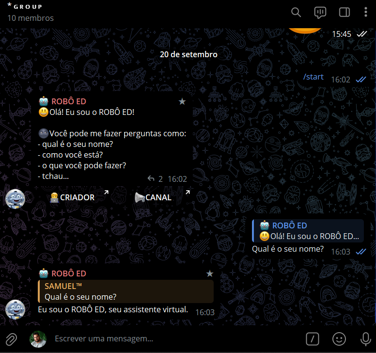
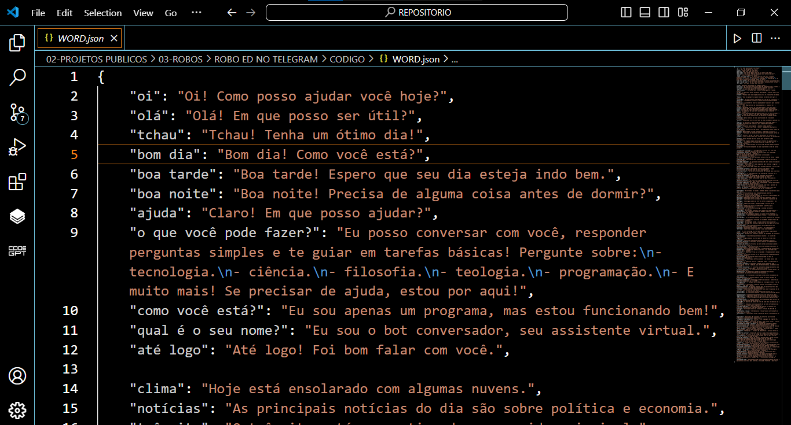
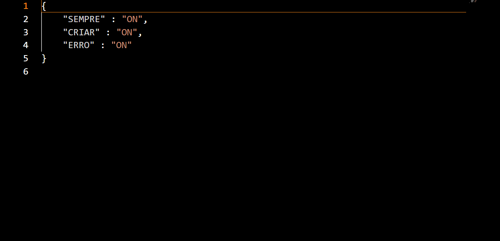

# ROBO ED NO TELEGRAM
🤖BOT DO TELEGRAM QUE CONVERSA NO GRUPO SOBRE UMA VARIEDADE DE TÓPICOS.

 <br>
 <br>
 <br>

## DESCRIÇÃO:
Este bot é um assistente virtual desenvolvido em Python, utilizando a biblioteca `Telebot` para interações via Telegram. Ele foi projetado para responder a mensagens de usuários com base em palavras-chave definidas e pode ser configurado para aprender novas respostas. Além disso, o bot carrega dois arquivos principais no início: "WORD.json" e "CONFIG.json".

- **"WORD.json"** contém palavras-chave e suas respectivas respostas, possibilitando que o bot responda a perguntas de maneira eficiente.
- **"CONFIG.json"** define as configurações do bot, como comportamento em chats e modo de erro. Permite personalizar como o bot reage a situações específicas, como a falta de respostas predefinidas.

## FUNCIONALIDADES:
1. **Respostas a Perguntas Comuns:**
   - O bot é capaz de responder a perguntas simples, como "qual é o seu nome?", "como você está?", "o que você pode fazer?", e saudações como "oi" e "tchau".
   - Além disso, pode fornecer respostas sobre tópicos como programação, ciência, tecnologia, entre outros.

2. **Gerenciamento Dinâmico de Respostas:**
   - Se uma mensagem não corresponder a nenhuma resposta pré-definida, e o modo de erro e criação estiverem habilitados no arquivo "CONFIG.json", o bot solicitará ao usuário que forneça uma resposta para ser adicionada ao banco de dados.
   - Ao receber uma entrada no formato correto (`PALAVRA CHAVE: RESPOSTA`), o bot armazena a nova palavra-chave no arquivo "WORD.json" e reinicia para aplicar a nova configuração.

3. **Configurações Avançadas via "CONFIG.json":**
   - O comportamento do bot é definido por configurações como:
     - **"SEMPRE"**: Define se o bot deve responder sempre, independentemente do tipo de chat.
     - **"CRIAR"**: Habilita ou desabilita a funcionalidade de adicionar novas respostas.
     - **"ERRO"**: Controla se o bot deve enviar mensagens de erro quando não entende a entrada do usuário.

4. **Reconhecimento de Palavras-chave em Frases:**
   - O bot é capaz de identificar palavras-chave dentro de uma frase completa, permitindo maior flexibilidade na forma como o usuário interage.
   - Mesmo que a palavra-chave não seja a única palavra na frase, o bot pode reconhecer e fornecer a resposta correspondente.

5. **Tratamento de Mensagens Não Compreendidas:**
   - Se o bot não entender a mensagem, ele pode, dependendo das configurações, sugerir que o usuário siga o formato específico para adicionar uma nova palavra-chave ou simplesmente informar que não entendeu.
   - Se a funcionalidade de criação estiver ativa, o bot solicitará uma entrada formatada para adicionar novas palavras e respostas.

6. **Comandos Iniciais e Marcações:**
   - O comando `/start` é utilizado para iniciar o bot, enviando uma mensagem de boas-vindas e apresentando ao usuário algumas opções de interação.
   - O bot também apresenta botões inline com links para o canal e o criador, utilizando o `InlineKeyboardMarkup` do Telegram.

## COMO USAR?
1. **Instale as bibliotecas necessárias:** Antes de executar o bot, certifique-se de instalar todas as dependências necessárias. No terminal, execute o seguinte comando para instalar as dependências listadas no arquivo requirements.txt em `CODIGO`:
   ```bash
   pip install -r requirements.txt
   ```
   
2. **Coloque o Token:**
   - Antes de executar o bot, é necessário substituir pelo seu token no arquivo `TOKEN.py`, o qual pode ser obtido por meio do [@BotFather](https://t.me/BotFather).

3. **Adicionar o Bot a um Grupo:** Adicione o bot ao grupo do Telegram onde você deseja que ele converse.

4. **Executar o Bot:** Inicie o bot. Ele começará a monitorar as mensagens no grupo e responderá automaticamente quando uma palavra-chave definida for encontrada em uma mensagem.
- Execute o bot do Telegram em Python iniciando-o com o seguinte comando:

   ```bash
   python MAIN.py
   ```
   
   - Inicie o bot enviando o comando `/start`. 

5. **Interagir com o Bot:** Agora, sempre que alguém enviar uma mensagem contendo uma das palavras-chave definidas, o bot responderá automaticamente à mensagem com uma resposta correspondente.

6. **Configure o Arquivo `WORD.json`:** No arquivo "WORD.json", você pode definir as palavras-chave desejadas como chaves do dicionário e as respostas correspondentes como valores associados.

   Por exemplo:

   ```json
   {
      "novo": "todos nós estamos aprendendo!",
      "cheguei": "seja bem vindo!",
      "feliz": "isso é bom!",
      "python": "python é uma linguagem de programação muito poderosa e versátil"
   }
   ```

## COMO USAR O `CONFIG.json`?
### DESCRIÇÃO:
Aqui está uma descrição do que acontece quando cada chave no arquivo "CONFIG.json" está definida como "ON" ou "OFF":

| Chave   | Descrição                                 | Comportamento quando "ON"                            | Comportamento quando "OFF"                           |
|---------|-------------------------------------------|-------------------------------------------------------|-------------------------------------------------------|
| SEMPRE  | Sempre Responder                          | O bot responderá a todas as mensagens, independentemente se for mencionado via user (@). | O bot responderá apenas se for mencionado via user (@). |
| CRIAR   | Permitir Adicionar Respostas              | Os usuários poderão adicionar novas respostas ao banco de dados do bot. | Os usuários não poderão adicionar novas respostas.    |
| ERRO    | Ativar Mensagem de Erro                   | Se o bot não entender a mensagem do usuário, ele enviará uma mensagem indicando que não compreendeu e oferecerá orientações sobre como reenviar a mensagem seguindo um formato específico. | Se o bot não entender a mensagem do usuário, ele não enviará uma mensagem de erro e não oferecerá orientações para reenviar a mensagem. |

### PADRÃO:
Por padrão, eu configurei o arquivo "CONFIG.json" com as seguintes configurações:

```json
{
    "SEMPRE": "ON",
    "CRIAR": "ON",
    "ERRO": "ON"
}
```

Significa o seguinte:

- **SEMPRE: "ON"**
  - Isso significa que o bot estará sempre pronto para responder a qualquer mensagem que receber no grupo, Mesmo que o user dele não seja mencionado.

- **CRIAR: "ON"**
  - Com esta configuração, os usuários poderão adicionar novas respostas ao banco de dados do bot.

- **ERRO: "ON"**
  - Isso indica que o bot está configurado para enviar uma mensagem de erro quando não entender a mensagem do usuário.

Essas configurações permitem controlar o comportamento do bot de acordo com suas necessidades e preferências. Ajuste as configurações conforme desejado para personalizar a experiência do bot de acordo com sua necessidade.


## NÃO SABE?
- Entendemos que para manipular arquivos em muitas linguagens e tecnologias relacionadas, é necessário possuir conhecimento nessas áreas. Para auxiliar nesse aprendizado, oferecemos alguns subsidios:
* [CURSO DE TELEBOT](https://github.com/VILHALVA/CURSO-DE-TELEBOT)
* [CURSO DE PYTHON](https://github.com/VILHALVA/CURSO-DE-PYTHON)
* [CURSO DE JSON](https://github.com/VILHALVA/CURSO-DE-JSON)
* [CONFIRA MAIS CURSOS](https://github.com/VILHALVA?tab=repositories&q=+topic:CURSO)

## CREDITOS:
- [PROJETO BASEADO NO "CONVERSADOR NO TELEGRAM"](https://github.com/VILHALVA/CONVERSADOR-NO-TELEGRAM)
- [ACESSE AO BOT NO TELEGRAM](https://t.me/ROBO_ED_BOT)
- [PROJETO FEITO PELO VILHALVA](https://github.com/VILHALVA)
